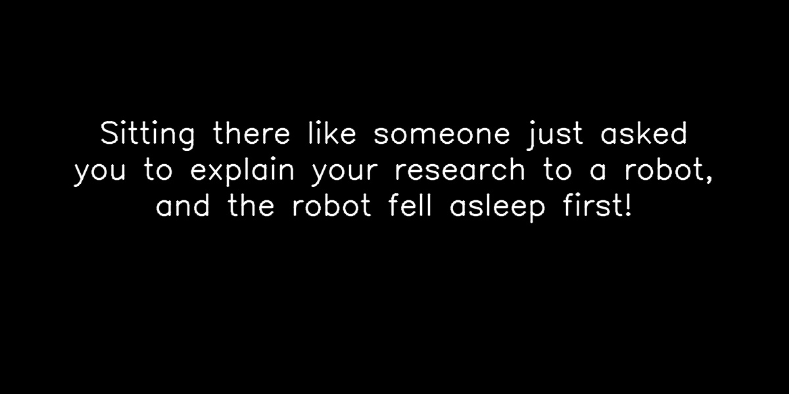

# roast_bot

### Description

This is a demo to showcase Jackal as a AI research platform as well as the features of the Zed 2 / Zed X cameras. It was built for the 2025 Canadian AI Conference in Calgary.

The repo includes two main nodes:
1. A custom ROS2 node built from the Zed Body Tracking API: https://www.stereolabs.com/docs/body-tracking/using-body-tracking. The user needs to hold one hand above their head for 5 seconds to start the image capture countdown. There is support to track more than one person.
2. A second custom ROS2 node that makes two ChatGPT API calls (cloud). The first call roasts the users in the cropped image using gpt-4.1. The second call generates a caricature from the cropped image using gpt-image-1.

There is also a webpage to capture contact details to send out the caricatures. 

Here is the hardware demo that was built for this and an example output

### Usage

    $cd ~/roast_bot_v3 && ./start_dev_tmux.sh

**Foxglove**
Open Foxglove Desktop App and a Websocket connection to ws://hostname:8765
Open the template saved in the main directory of this repo

**Roast Logger**
To save information on the roast session use the roast_logger web page: http://hostname:3000
Sessions are saved to the roast_media folder, data from the web page logger is saved to data.csv

### Installation

Requires:

- Zed 2 or Zed X camera
- Computer with an NVIDIA GPU
- ROS2 Humble or Jazzy

Steps if you want to install exactly as is

1. Install Zed SDK: https://www.stereolabs.com/en-ca/developers/release
2. Move 2 file directories in this repo to home directory ~/
3. Create virtual environment called zed-env in ~/venvs. If you don't install in a venv or name it something different, the tmux script will need to be adjusted
4. Add pyzed, opencv to zed-env
5. Install openai python library. You could add this to the zed-env, but a small change to the start up script would be required
6. Install node-js if not already installed
7. Add Open API key to the roast node
8. If the roast_bot_v3 node is in the home directory you should be able to run the start script with the instruction above. 
